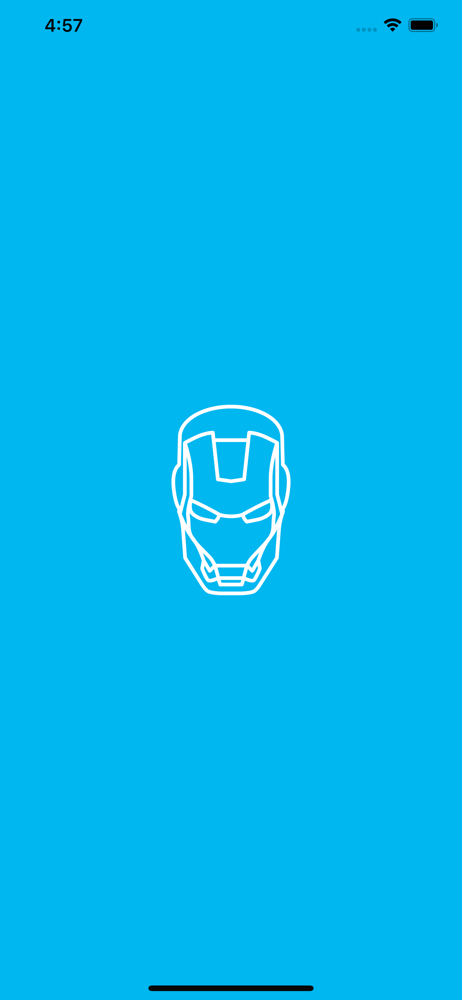
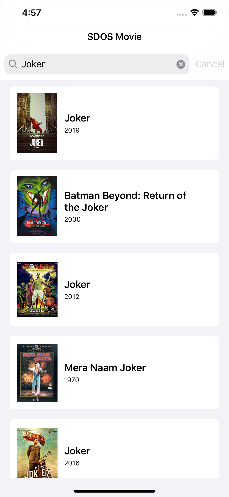
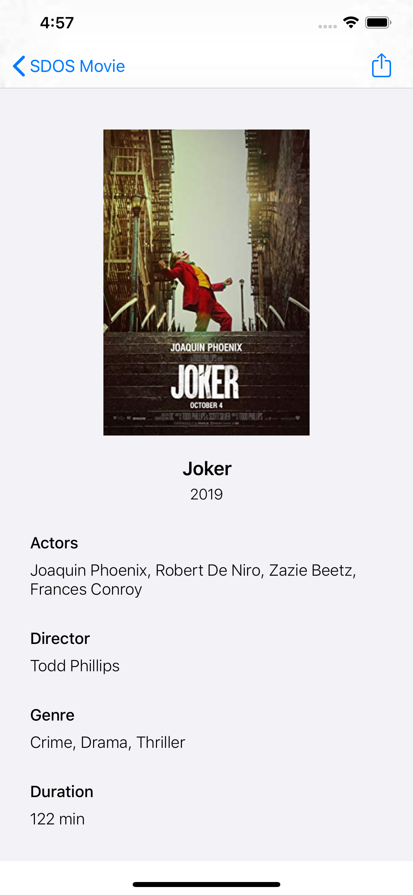
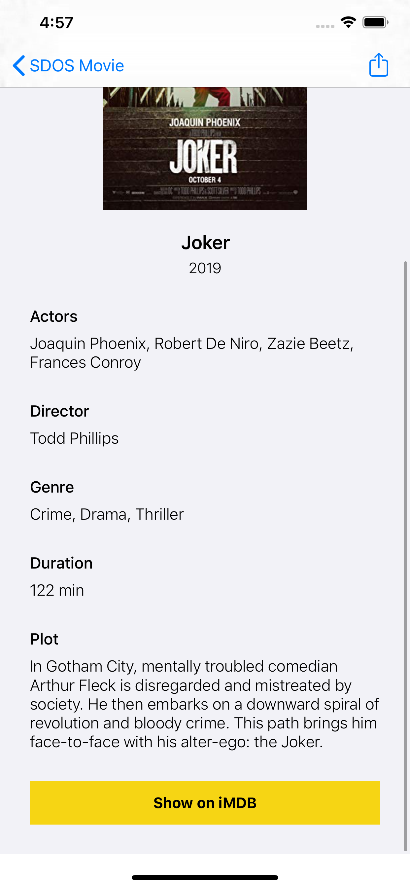
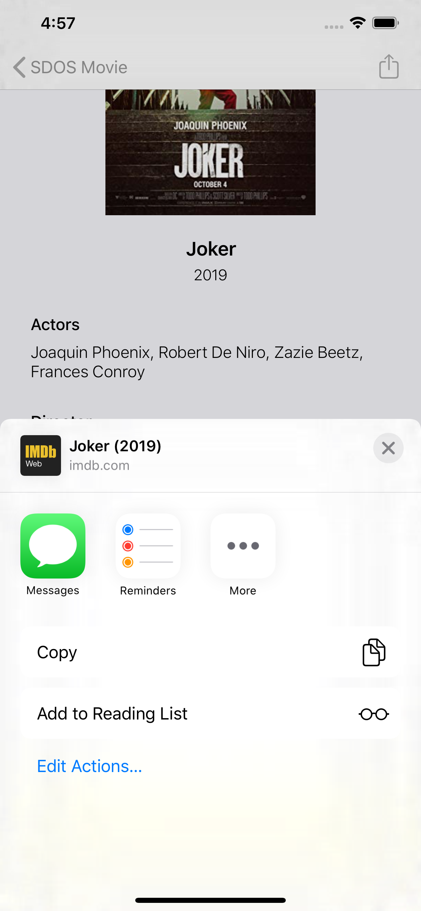
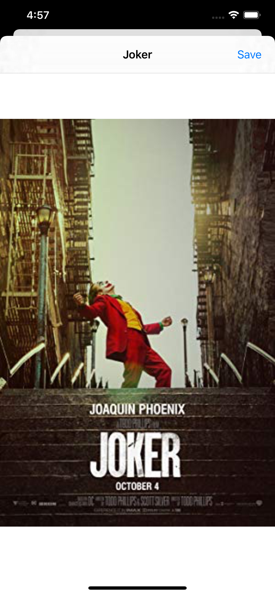

# SDOSMovie Search - OMDb API

SDOSMovie iOS App es un buscador de películas escrito en Swift 5 usando la API OMDb.

## Screenshots

## Requerimientos
- Xcode 11.3+
- Swift 5.0+
- iOS 13.2+

## Features
App desarrollada basándose en la arquitectura (MVC) modelo vista controlador.
Para la conexión con la API se ha usado la clase nativa URLSession.

La aplicación consta de 3 pantallas:
- Un buscador de películas que es la pantalla principal. Se hace una llamada a la API por título de película y se muestra un listado con las películas encontradas.
- El detalle de una película, que se accede desde la pantalla anterior. Se hace una llamada a la API para obtener el detalle de una película a partir del ID y se muestra toda la información. Si se pulsa en la imagen del poster se abre la siguiente vista. Si se pulsa sobre los textos de información de la película se copia dicho texto en el portapapeles del dispositivo. 
- Poster a pantalla completa, se muestra el poster de la película a pantalla completa y se puede guardar en el carrete del dispositivo.

## Instalación
1. Descarga el fichero zip o clona el repositorio.
2. Navega a través de Terminal hasta la carpeta del proyecto.
3. Ejecuta `pod install`
4. Abre SDOSMovie.xcworkspace y ejecuta el proyecto en un simulador o dispositivo.

## Librería de terceros.
Se ha usado la librería Kingfisher (https://github.com/onevcat/Kingfisher) para la descarga de imágenes.
